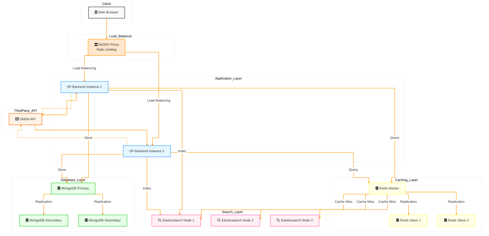

# Movie Search Application

A scalable, high-performance movie search application with distributed caching, full-text search, and automated data updates.

## System Architecture



## Features

- **High Availability**: Distributed architecture with no single point of failure
- **Scalable Backend**: Multiple Node.js instances behind NGINX load balancer
- **Distributed Caching**: Redis master-slave replication for fast data access
- **Full-Text Search**: Elasticsearch cluster for efficient movie searches
- **Persistent Storage**: MongoDB replica set for data durability
- **Rate Limiting**: API request throttling via NGINX
- **Automated Updates**: Scheduled movie data fetching from OMDB API

## Prerequisites

- Docker and Docker Compose
- Node.js 18+
- OMDB API Key (get one from http://www.omdbapi.com/)
- At least 8GB RAM for running all services

## Quick Start

1. Clone the repository:
```bash
git clone <repository-url>
cd Elastic-Search-TAsk
```

2. Create `.env` file from example:
```bash
cp var.env.example .env
```

3. Update the environment variables in `.env`:
```env
# Required configurations
OMDB_API_KEY=your_api_key_here
REDIS_PASSWORD=your_secure_password
!! Currently I have added OMDB_API_KEY and REDIS_PASSWORD variables no need to add any change anything.
```

4. Run the setup script (Linux/macOS):
```bash
sudo ./scripts/setup-host.sh
```

5. Start the application:
```bash
docker-compose up --scale backend=2 -d
```

The application will be available at:
- Frontend: http://localhost:3000
- API Gateway: http://localhost:80
- Elasticsearch: http://localhost:9200

## Environment Variables

| Variable | Description | Default |
|----------|-------------|---------|
| MONGODB_URI | MongoDB connection string | mongodb://mongodb1:27017,... |
| ELASTICSEARCH_NODES | Elasticsearch nodes | http://es01:9200,... |
| REDIS_PASSWORD | Redis authentication | required |
| OMDB_API_KEY | OMDB API key | required |
| PORT | Backend port | 5000 |
| NODE_ENV | Environment | production |

## Project Structure

```
movie-search/
├── docker-compose.yml      # Docker services configuration
├── .env                 # Environment variables
├── backend/               
│   ├── src/
│   │   ├── controllers/   # Request handlers
│   │   ├── services/      # Business logic
│   │   ├── models/        # Data models
│   │   └── config/        # Configurations
│   └── tests/             # Backend tests
├── frontend/
│   ├── src/
│   │   ├── components/    # React components
│   │   └── services/      # API clients
│   └── tests/             # Frontend tests
└── nginx/                 # NGINX configuration
```

## API Endpoints

| Endpoint | Method | Description | Rate Limit |
|----------|--------|-------------|------------|
| /api/movies/search | GET | Search movies | 100/min |
| /api/movies/fetch | POST | Update movie database | 1/hour |

## Development

1. Install dependencies:
```bash
# Backend
cd backend && npm install

# Frontend
cd frontend && npm install
```

2. Run tests:
```bash
# Backend tests
cd backend && npm test

# Frontend tests
cd frontend && npm test
```

## Monitoring

- NGINX logs: `./logs/nginx/`
- Application logs: `./logs/app/`
- MongoDB logs: `./logs/mongodb/`

## Security

- NGINX rate limiting
- Redis password authentication
- Environment variable encryption
- No sensitive data in logs
- Secure communication between services

## Performance

- Redis caching for frequent searches
- Elasticsearch for fast full-text search
- MongoDB replica set for read scaling
- NGINX load balancing
- Response time optimization

## Using the Application

1. When the application starts, it automatically fetches space-themed movies from 2020 from the OMDB API
2. Use the search bar to search for movies by:
   - Title
   - Director
   - Plot
3. Results will display:
   - Movie poster
   - Title
   - Director
   - Plot

## Development

- Frontend code is in the `frontend` directory
- Backend code is in the `backend` directory
- Tests can be run using `npm test` in respective directories

